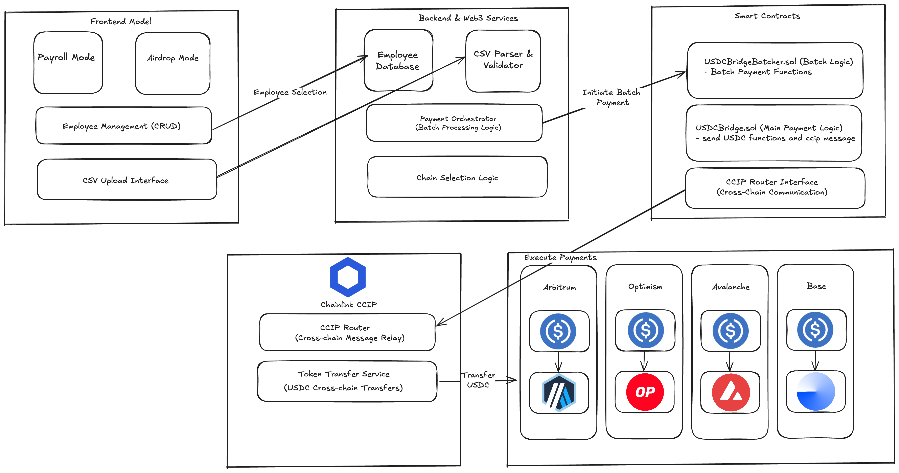

# BridgePay: One-Click Multichain Payment System

> *Revolutionizing cross-chain payments with Chainlink CCIP*

[](https://opensource.org/licenses/MIT)
[](https://chain.link)
[](https://soliditylang.org/)

## The Problem BridgePay solves

Crypto companies currently waste several hours managing payroll across multiple blockchains. Each chain requires separate transactions, wallets, and gas fees, leading to operational inefficiency and high costs.

**BridgePay transforms this:** From hours of manual work to **one-click multichain payments** powered by Chainlink CCIP.

Create, Edit or Delete employees. There are two bridges, one for payment to single recipient and another one for batch payment to multiple recipients. In the latter, there are two modes - Normal and Airdrop. In Airdrop mode, users can upload csv files which will be parsed and added to the queue for executing batch payments. You can view your transaction history on the dashboard.

BridgePay is one of the first unified multichain payment system that enables:

- **Manage Unlimited Employees** - Add employees with their preferred receiving chains
- **One-Click Payroll** - Pay all employees across different chains simultaneously in USDC
- **Selective Payments** - Choose specific employees or pay everyone
- **CSV Airdrops** - Upload recipient lists and distribute to thousands instantly
- **Chainlink CCIP Integration** - Secure, reliable cross-chain communication

## Architecture & Tech Stack

### System Architecture


### Tech Stack

**Frontend**
- **Next.js** - Modern UI with hooks
- **TypeScript** - Type-safe development
- **Tailwind CSS** - Responsive design
- **Wagmi** - Blockchain interaction

**Blockchain**
- **Solidity 0.8.24** - Smart contract language
- **Chainlink CCIP** - Cross-chain communication
- **Foundry** - Development framework

## Foundry Setup

Install the prerequisites
```bash
forge install
```

Deploy your contract on different chains
```bash
make deploy-eth
```

Make bridges between two chains
```bash
make bridge ethereum-arbitrum
```

Modify the Makefile inside `contracts` folder to add your own chain (supported by CCIP)

## Chainlink Integration Files

### Core CCIP Implementation
- [`contracts/src/USDCBridge.sol`](./contracts/src/USDCBridge.sol) - Main payment contract with CCIP integration
- [`contracts/src/USDCBridgeBatcher.sol`](./contracts/src/USDCBridgeBatcher.sol) - Batch payment functions

## Impact

| Metric | Before BridgePay | After BridgePay
|--------|----------------|----------------|
| **Time per Payroll** | 2-4 hours | 5 minutes
| **Gas Costs** | Individual txs | Batched + optimized
| **Error Rate** | Manual mistakes | Automated validation
| **Operational Cost** | High overhead | Streamlined process

## License

This project is licensed under the MIT License

## Links
USDCBridge.sol contract deployed at 
- Ethereum Sepolia: https://sepolia.etherscan.io/address/0x03D8487343D7e5e8E8bB81039083EF9652B4c2ba
- Arbitrum Sepolia: https://sepolia.arbiscan.io/address/0x800991Fa16f703eF65293681C78ca44B42707748
- OP Sepolia: https://sepolia-optimism.etherscan.io/address/0x42AC28dB42F5BE11B922f84893F3D4b960a28968
- Base Sepolia: https://sepolia.basescan.org/address/0xD987E37667b7DD9FAEE3274Cd96272205ea1Db9E
- Avalanche Fuji: https://testnet.snowtrace.io/address/0x8789f82614250E52dB6AB8ADfDCdB0eEF57de9f1

USDCBridgeBatcher.sol contract deployed at Ethereum Sepolia: https://sepolia.etherscan.io/address/0xD987E37667b7DD9FAEE3274Cd96272205ea1Db9E


> *"BridgePay doesn't just use Chainlink CCIP,  it showcases the future of cross-chain applications. This is what the decentralized economy needs: simple, secure, and scalable multichain solutions."*

**Built with ❤️ and powered by Chainlink CCIP**